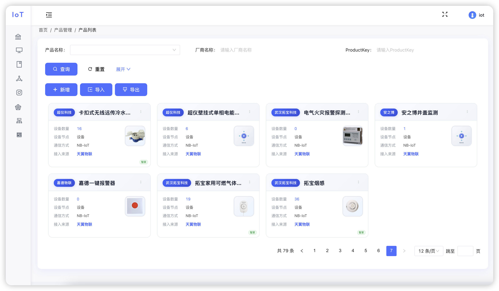
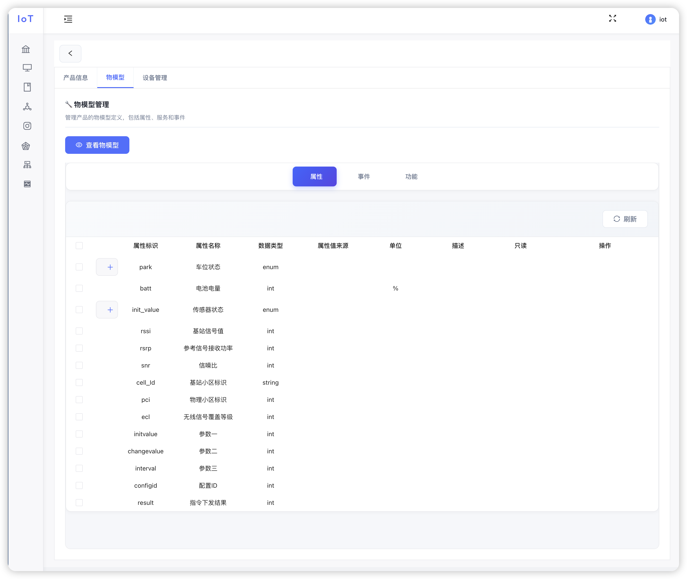
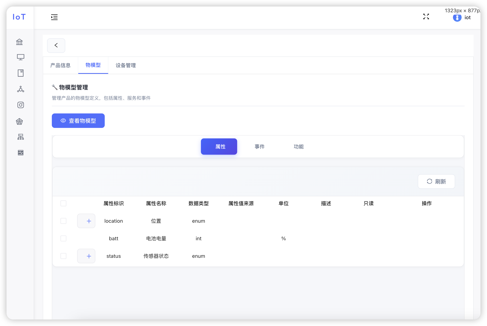
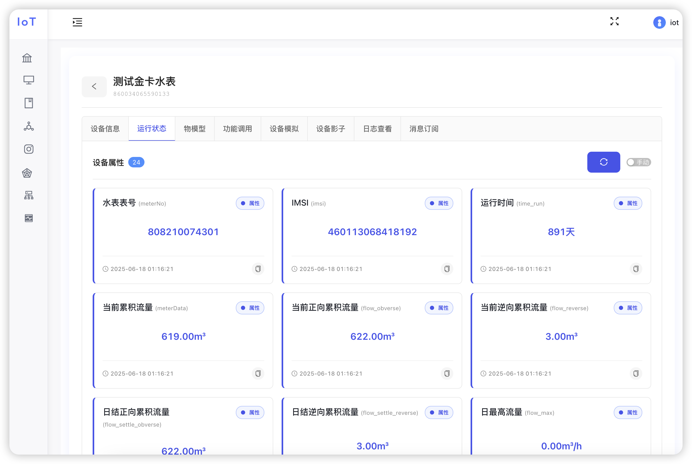
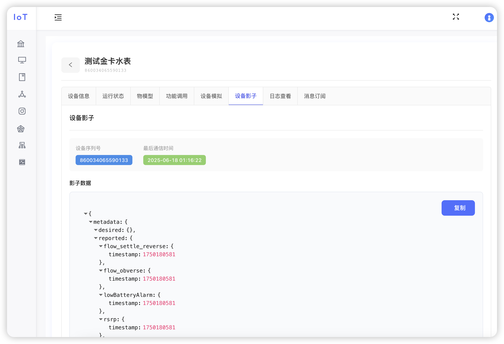
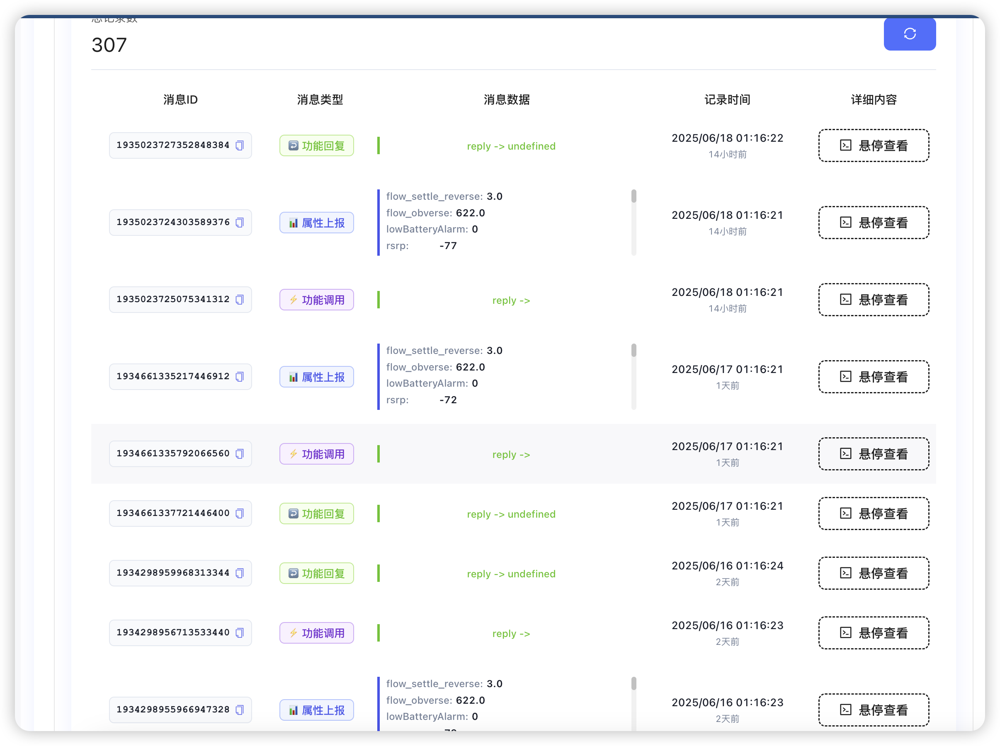
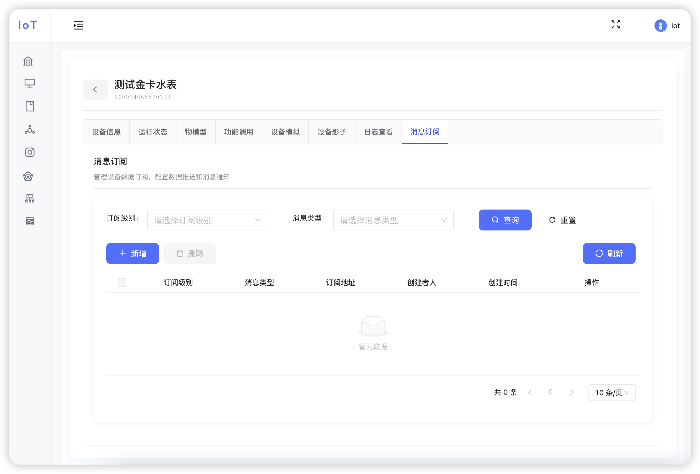
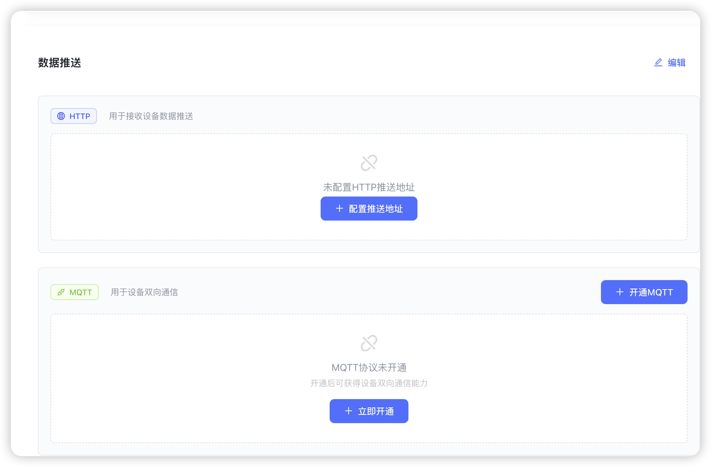

# Universal IoT 物联网平台

文档地址：https://phoenixhai.github.io/universal-iot-docs/

微信：outlookFil

## 平台简介

Universal IoT
是一款基于Java技术栈构建的企业级物联网平台，具备高度灵活性和可扩展性。平台集成了云调试功能，支持TCP、MQTT、天翼物联、HTTP等多种协议的统一管理，提供完整的产品定义、物模型设计、设备接入、北向应用输出、规则引擎等核心功能，为物联网应用提供一站式解决方案。

## ✅ 平台功能总结

### 🚀 设备接入能力

- ✅ **TCP设备接入**：16进制报文传输、协议解析、云调试、在线测试
- ✅ **MQTT设备接入**：物模型/透传模式、云调试、在线测试、支持EMQX/HiveMQ等
- ✅ **HTTP设备接入**：REST API、Java SDK、OAuth2认证、完整接口规范
- ✅ **天翼物联接入**：设备注册、数据上报、指令下发、标准协议对接
- 🔄 **移动OneNET接入**：开发中，支持设备注册、数据上报、指令下发
- 🔄 **云云对接接入**：开发中，支持多平台数据同步、协议转换

### 🎯 核心管理功能

- ✅ **产品管理**：多协议产品创建、物模型定义、产品标签、公共配置
- ✅ **协议管理**：云调试环境、插件化架构、实时协议开发、统一管理平台
- ✅ **设备管理**：设备详情监控、在线指令下发、设备影子、消息订阅、日志查看
- ✅ **网络组件**：TCP/MQTT服务管理、启动/暂停/禁用操作、个性化参数配置
- ✅ **应用管理**：北向应用输出、OAuth2 API SDK、设备绑定、推送配置
- ✅ **通知管理**：多渠道支持（钉钉、阿里云、腾讯云、webhook、邮箱、飞书）
- ✅ **场景联动**：基于设备属性/事件的触发规则、多动作执行、实时自动化

### 🔧 技术特性

- ✅ **云调试功能**：基于浏览器的实时协议开发和调试
- ✅ **插件化架构**：支持热部署和功能扩展
- ✅ **多协议支持**：TCP、MQTT、HTTP、天翼物联等协议统一管理
- ✅ **企业级特性**：支持大规模设备接入、高可用架构
- ✅ **标准化设计**：遵循物联网行业标准，与jetlink同根同源

## 核心功能

### 🚀 设备接入能力

| 协议类型         | 状态     | 核心功能                              |
|--------------|--------|-----------------------------------|
| **TCP设备**    | ✅ 已实现  | 16进制报文传输、协议解析、云调试、在线测试            |
| **MQTT设备**   | ✅ 已实现  | 物模型/透传模式、云调试、在线测试、支持EMQX/HiveMQ等  |
| **HTTP设备**   | ✅ 已实现  | REST API、Java SDK、OAuth2认证、完整接口规范 |
| **天翼物联**     | ✅ 已实现  | 设备注册、数据上报、指令下发、标准协议对接             |
| **移动OneNET** | 🔄 开发中 | 设备注册、数据上报、指令下发                    |
| **云云对接**     | 🔄 开发中 | 多平台数据同步、协议转换                      |

### 🎯 核心模块

#### 产品管理

- 多协议产品创建（TCP/MQTT/HTTP/天翼物联/云云对接）
- 完整物模型定义和管理（与jetlink同根同源）
- 产品标签和公共配置（离线阈值、定位设备、自动注册等）
- 端云配置和个性化参数

#### 协议管理

- 基于浏览器的云调试环境
- 插件化架构，支持热部署
- 实时协议开发和调试
- 统一协议管理平台

#### 设备管理

- 设备详情和运行状态监控
- 在线指令下发和设备模拟
- 设备影子、消息订阅、日志查看
- 设备分组和批量操作

#### 网络组件

- TCP/MQTT服务在线管理
- 服务启动/暂停/禁用操作
- 个性化参数配置和监控
- 灵活的网络服务管理

#### 应用管理

- 北向应用输出功能
- OAuth2 API SDK
- 设备绑定和推送配置
- 支持HTTP/MQTT/RocketMQ/DB存储

#### 通知管理

- 多渠道支持：钉钉、阿里云、腾讯云、webhook、邮箱、飞书
- 自定义模版和变量配置
- 规则引擎关联推送
- 通知历史和状态监控

#### 场景联动

- 基于设备属性/事件的触发规则
- 多动作执行（设备指令、通知发送）
- 实时执行和自动化操作
- 执行日志和通知历史

## 技术架构

::: tip 技术栈

- **后端框架**：`Java 21` `SpringBoot 3.5` `Tk.Mybatis 5.0.1` `Netty 4.2.2.Final`
- **数据存储**：MySQL5.7+ / Redis / RocketMQ
- **架构模式**：单体架构设计，支持微服务化部署
- **前端技术**：基于`RuoYi-Antdv`构建，感谢开源社区！

:::

## 平台特性

- **🔧 高度灵活**：支持多种协议和设备类型
- **📈 可扩展性**：插件化架构，支持功能扩展
- **🐛 实时调试**：提供强大的云调试功能
- **🏢 企业级**：支持大规模设备接入和管理
- **📋 标准化**：遵循物联网行业标准

## 界面展示

### 产品管理界面

产品管理界面展示平台的核心功能，包括产品创建、配置管理、物模型定义等完整的产品生命周期管理功能。

### 协议调试功能

协议调试运行结果展示，提供实时的协议解析效果和强大的调试功能，支持在线编辑和测试。

